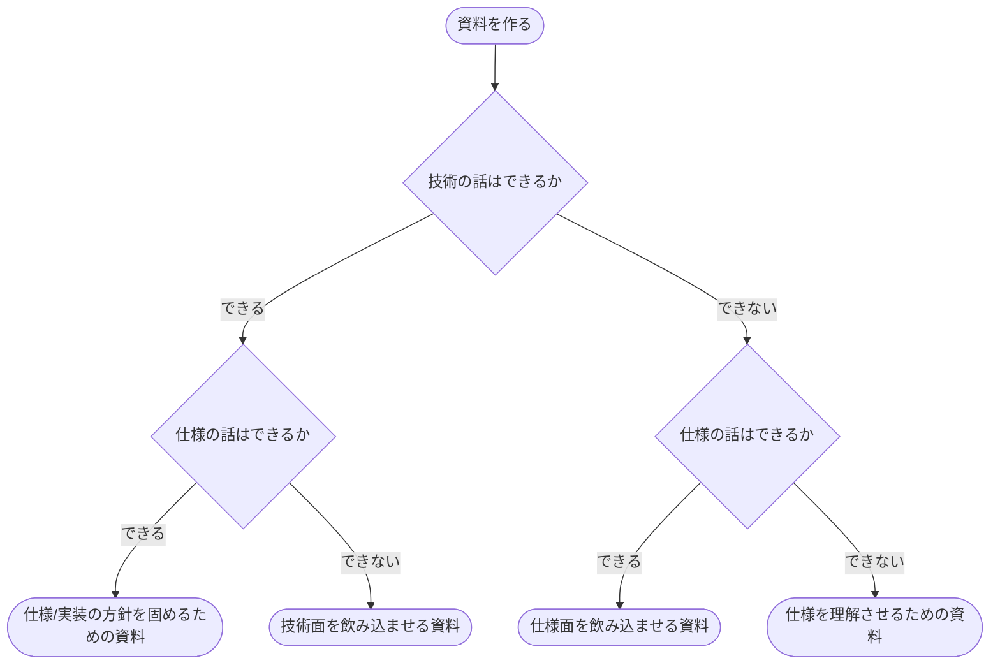

# 対外部資料

対外部については色々と考えるべきことがあります。  
ここは抑えるべき内容をここではピックアップします

## 誰がみるか

誰がみるかによって資料の内容を変える必要があります。  
例えば技術を知らない人に技術の話の資料を見せても意味がありません  
逆に技術は知っているが仕様を知らない人に仕様の話をしても意味がありません  
何を理解できるかをベースにして、資料を作成する必要があります

## ゴールを決める

上の誰がみるか、にありますが、技術/仕様の両者を持つお客様はそれほど多くありません  
どちらもを把握することを目標にすることも素晴らしいですが、お客様の担当者にはその人の立場があります  
なのでその人が課題に対して、先方の内部でアクションを起こせるように資料を作る必要があります

## 誰/ゴールの掛け合わせ

以上の 2 点を踏まえてざっくりとケースを示します

**case: 仕様はわかるが技術がわからないお客様への資料場合**  
実装の話はしないで、仕様を満たす場合の挙動などを詰めた資料を提供します  
内部で実装の検討はしますが、その内容は伝えずにあくまで内部の検討資料などにします  
ゴールは仕様を満たせることを伝えることで、そこに注力した資料を作成します

**case: 技術はわかるが仕様がわからないお客様への資料場合**  
実装などの実現可能性ベースで資料を作成します  
仕様も前提にありますが、技術がわかるお客様は実装などでの懸念点についての深掘りをされるケースがあるので、そういったケースに回答できるようにしておくと良いです  
ゴールは技術的な面での理解をして、仕様を判断できる先方のメンバーに説明をできる状態にするところになります

**case: どちらもわかる場合**  
実は一番難しく、仕様/技術ともに理解があるため、両方での懸念点を回答できるようにしておく必要があります  
回答が難しい場合は、逆に相談に乗ってくれるケースもあるため、含みを持たせるのも悪くはない手段です  
ゴールは仕様/実装の両方の方針を概ね固めることです

## フローチャート

以上を簡単にフローチャートとすると以下のようになります

## 資料の難易度

下記はそれぞれ作る資料の難易度（=コスト）になります

| 資料                              | 難易度 | 備考                                                                                                                                |
| :-------------------------------- | :----- | :---------------------------------------------------------------------------------------------------------------------------------- |
| 仕様/実装の方針を固めるための資料 | 高     | 詰められる部分を詰めておく必要がある 逆に決めきる機会でもあるので資料としてもちゃんと作りたい                                  |
| 技術面を飲み込ませる資料          | 中     | 技術に感関する話をも k 時として書く必要があるのでそこが難しい 相手が仕様を把握するメンバーとやり取りするまでのフォローも必要    |
| 仕様面を飲み込ませる資料          | 中-低  | 技術のコアな部分には言及は不要 可能なら視覚的にわかるものを準備しておくと話が早い                                               |
| 仕様を理解させるための資料        | 低     | そもそもこれを作る時点で先方の理解がないので若干諦め 温度感が高いものであれば、温度感を伝えて上の人間を引き出す方法をとると良い |
