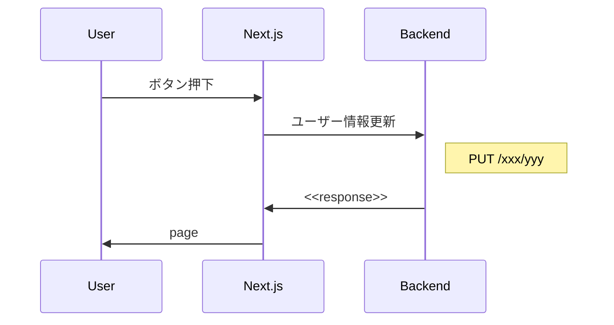

# 対内部資料

対内部資料といっても様々な資料があります。  
ここではプログラマとして書くことの多い、 **内部での仕様やフローの認識あわせ** のための資料についてを書いていきます

## 資料のゴール

対内部の資料のゴールは、**合意形成をすること**です。  
仕様やフローなどの認識相違や実現可否を極力減らすことに注力をします。

## 資料の作り方

### フォーマット

まずフォーマットですが、対内部においては証跡さえ残せればどのように作っても良いと思っています。  
これは雑に作ることを推奨しているのではなく、速度と認識あわせができれば良いため、フォーマットを凝る必要がないということです。

### 内容

内容についてもゴールを満たせるのであれば雑でも良いです。  
ここも雑に作って良いというわけではなくて、課題に対しての検討及び整理ができていれば全てを固め切る必要はないという意味です。  
各人が叩くことのできるものを用意するというイメージができるといいかなと思っています。

#### サンプル

自分が内部資料を作る際は

- 手書き
- mermaid
- draw.io

あたりを利用します

e.g.) mermaid

このように

- 視覚的に見える = 叩けるようにする
- ある程度整理された状態にする = 認識の相違を避けられるようにする

状態を作ってあげることが内部資料としては大事かなと思っています

## alt:それ以外の内部資料作成について

上記のような認識合わせのための資料以外、誰かを納得させるための資料を作る場合は **数字的な裏付け** を意識することが大事です  
例えば A というサービスを利用したい場合、そのサービスを利用することで得られる恩恵を数字的に示さなければ相手を動かすことはできません。  
数字の簡単な例としては

- 金銭（n 円の削減）
- 工数（n 人日/時間の削減）

といった具体的な数値が示せると相手を納得させられる = 判断材料にできる資料にすることができます
